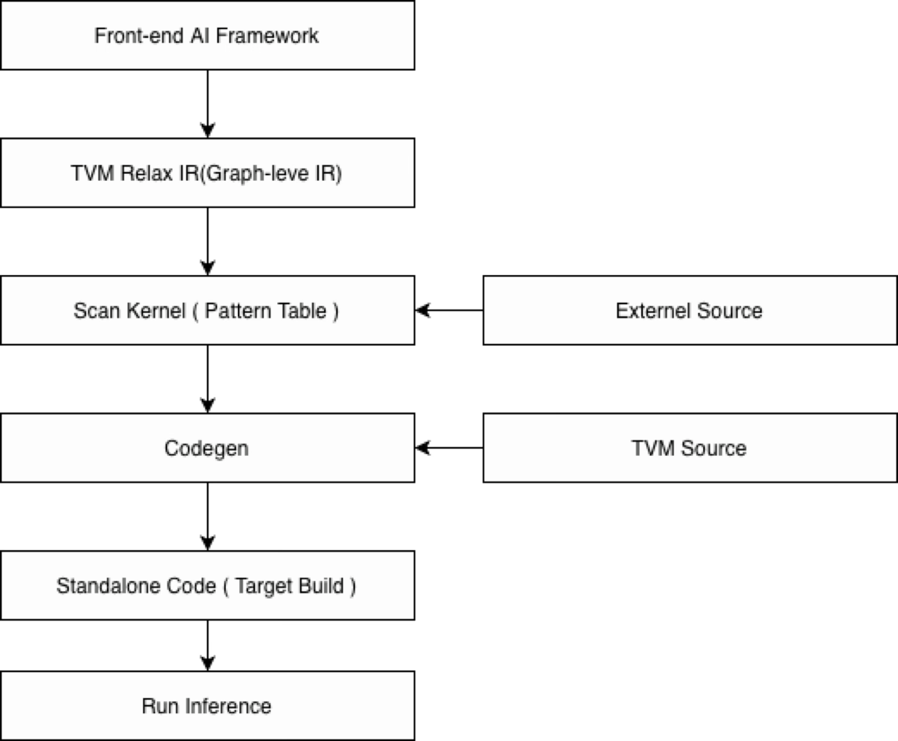

<!--- Licensed to the Apache Software Foundation (ASF) under one -->
<!--- or more contributor license agreements.  See the NOTICE file -->
<!--- distributed with this work for additional information -->
<!--- regarding copyright ownership.  The ASF licenses this file -->
<!--- to you under the Apache License, Version 2.0 (the -->
<!--- "License"); you may not use this file except in compliance -->
<!--- with the License.  You may obtain a copy of the License at -->

<!---   http://www.apache.org/licenses/LICENSE-2.0 -->

<!--- Unless required by applicable law or agreed to in writing, -->
<!--- software distributed under the License is distributed on an -->
<!--- "AS IS" BASIS, WITHOUT WARRANTIES OR CONDITIONS OF ANY -->
<!--- KIND, either express or implied.  See the License for the -->
<!--- specific language governing permissions and limitations -->
<!--- under the License. -->

# SENSE-TVM

[TVM PATCH](https://cochl.atlassian.net/wiki/spaces/D/pages/1755414532/TVM+UPSTREAM+Patch) |
[DESIGN](https://cochl.atlassian.net/wiki/spaces/D/pages/1725792260/TVM+Based+Compiler) |
[Release Notes](https://cochl.atlassian.net/wiki/spaces/D/pages/1755217941/SENSE-TVM+Release+Notes) |
[PDF](https://cochl.atlassian.net/wiki/spaces/D/pages/1678344195/TVM+Research) |

SENSE-TVM is an end-to-end compiler pipeline for converting models such as ONNX, Torch, and TFLite into C-oriented deployable outputs.

## Components

- [COCHL](python/tvm/cochl/README.md) Core compiler implementation
- [SENSE](sense/README.md) Interface and execution flow for SENSE models

## Getting Started

Build TVM first, then run the SENSE pipeline with a target configuration.

```bash
chmod +x build_sense.sh

# LLVM 17,18,19 && python <= 3.13 is stable on tvm
# ex) LLVM_CONFIG=/opt/homebrew/opt/llvm@19/bin/llvm-config ./build_sense.sh  
LLVM_CONFIG=/path/to/llvm-config-17 ./build_sense.sh

cd sense
python main.py --config=settings/rpi2.json --validate
```

`build_sense.sh` configures and builds TVM, installs the editable Python packages, and installs the Python dependencies required by SENSE.

## Configuration

The `sense/settings/{target}.json` file controls model input, target hardware, backend selection, output paths, and debug behavior.

Example: `sense/settings/rpi2.json`

```json
{
  "model_path": "onnx/model_main_17.onnx",
  "hardware": "rpi2",
  "build_option": {
    "backend": "ncnn",
    "opt_level": 3,
    "target_str": null
  },
  "optimizer": {
    "custom_passes": []
  },
  "export": {
    "output_dir": "./bin",
    "model_name": "sense_model_main",
    "save_tir": true,
    "save_weight_manifest": true
  },
  "debug": {
    "dump_operator_outputs": false,
    "measure_operator_delay": false
  }
}
```

Field descriptions:

- `model_path`: Input model path
- `hardware`: Target hardware name such as `rpi2`
- `build_option.backend`: Code generation backend such as `c` or `ncnn`
- `build_option.opt_level`: TVM optimization level from `0` to `3`
- `build_option.target_str`: Optional custom TVM target string
- `optimizer.custom_passes`: Optional extra optimization passes
- `export.output_dir`: Root output directory for generated artifacts
- `export.model_name`: Base filename for generated model sources
- `export.save_tir`: Save lowered TIR text output
- `export.save_weight_manifest`: Save weight metadata output
- `debug.dump_operator_outputs`: Enable intermediate tensor dump logic in codegen
- `debug.measure_operator_delay`: Enable per-operator timing logic in codegen

Validation:

- `python main.py --config=settings/rpi2.json --validate` loads the config, runs compile and export, and validates outputs against ONNX Runtime.

## Flow



Example flow with `sense/settings/rpi2.json`:

1. A front-end model such as `sense/onnx/model_main_17.onnx` is loaded by the SENSE entrypoint.
2. The model is translated into TVM Relax IR for graph-level optimization and partitioning.
3. The kernel scan stage matches supported patterns and selects implementations from TVM-generated code, COCHL sources, or external sources.
4. The codegen stage emits standalone artifacts such as `lib0.c`, `<model_name>.c`, metadata files, and weights.
5. The generated output is built for the target environment and can then be executed for inference.
6. When `--validate` is enabled, the generated result is compared against ONNX Runtime output.

## References

- [Ansor](https://github.com/cochlearai/Ansor): Partition and tiling experiments based on meta-schedule
- [TVM-Standalone](https://github.com/cochlearai/tvm_standalone_sample): Sample standalone output generated by SENSE-TVM
