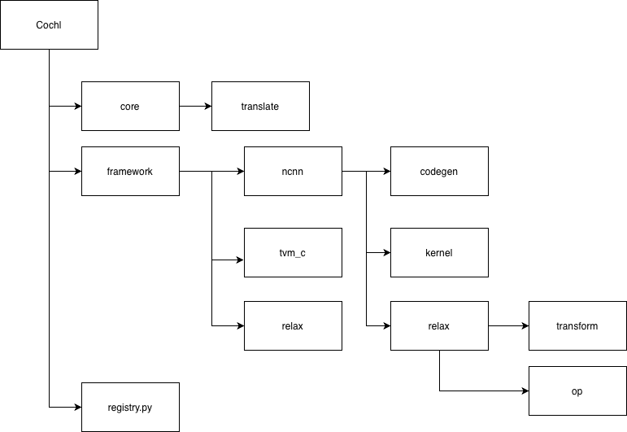

# COCHL

COCHL is the core compiler layer used by SENSE-TVM. It connects model translation, pass registration, backend selection, TIR pipeline setup, and standalone code generation inside the Python TVM integration.

## Architecture

The image above can be understood as a layer-by-layer compiler flow inside `python/tvm/cochl`.

### Layer overview

- `core / translate`: Accepts the front-end model and turns it into Relax IR with model metadata.
- `registry`: Chooses the backend path and connects the rest of the pipeline.
- `framework / relax`: Prepares Relax IR in a form that each backend can consume.
- `framework / ncnn`: Keeps the graph at a pattern-friendly level and maps it to external standalone kernels.
- `framework / tvm_c`: Lowers the graph further through TVM build flow and emits TVM-C style standalone code.
- `kernel`: Selects which kernel implementation or operator form should be used.
- `codegen`: Writes the final standalone source files, metadata, weights, and build files.

### `core / translate`

This is the input adaptation layer.

- Role: convert models from front-end formats such as ONNX into a common Relax IR.
- Output: Relax IR, input and output tensor metadata, and ordered weights.
- Meaning in the flow: this layer hides front-end differences and gives the rest of COCHL a unified compiler input.

### `registry`

This is the routing layer.

- Role: choose which backend-specific pipeline should run next.
- Input: hardware and backend information from SENSE configuration.
- Output: the Relax pass pipeline, codegen module, optional TIR pipeline, and makefile generator for the chosen target.
- Meaning in the flow: this layer splits one common compiler entry into backend-specific branches such as `ncnn` and `tvm_c`.

### `framework / relax`

This is the shared Relax preparation layer.

- Role: analyze or reshape Relax IR into a form that standalone codegen can consume.
- Output: execution-plan-like information such as tensors, storage, operation order, and object lifetime.
- Meaning in the flow: this layer provides a common understanding of the Relax program before backend-specific emission starts.

### `framework / ncnn`

This is the pattern-oriented backend layer.

- Role: keep the graph relatively high level, scan it with pattern tables, and map matched operators to external standalone kernels.
- `relax` responsibility: simplify and normalize the Relax graph without fully lowering it away.
- `kernel` responsibility: identify supported operator patterns and decide which NCNN-style standalone function should implement them.
- `codegen` responsibility: combine the matched kernel plan with generated sources and emit deployable standalone code.
- Meaning in the flow: this branch is used when operator-level mapping to external optimized kernels is the main strategy.

### `framework / tvm_c`

This is the TVM-lowered backend layer.

- Role: lower the program deeper into the TVM compilation stack and use TVM-generated C artifacts as the base for standalone output.
- `relax` responsibility: run a stronger lowering pipeline including legalization, memory planning, runtime lowering, and TIR preparation.
- `kernel` responsibility: on this path, kernel decisions are less about external pattern mapping and more about accepting TVM-lowered function structure.
- `codegen` responsibility: read the lowered result, pack weights and memory layout, and emit direct-call standalone inference code.
- Meaning in the flow: this branch is used when the backend should stay closer to TVM's own lowered C generation path.

### How to read the flow by layer

You can read the architecture image from top to bottom like this:

1. `core / translate` normalizes the front-end model into Relax IR.
2. `registry` decides which backend branch should own the rest of the compilation.
3. `framework / relax` prepares a backend-consumable Relax representation.
4. The flow then splits:
   `framework / ncnn` focuses on pattern matching and external kernel mapping.
   `framework / tvm_c` focuses on deeper TVM lowering and TVM-generated C artifacts.
5. `kernel` decides the implementation view of each operator or lowered call.
6. `codegen` turns that plan into standalone outputs.

In short, `python/tvm/cochl` is organized as layered responsibilities:
input translation -> backend routing -> Relax preparation -> kernel selection strategy -> standalone code generation.
